# Inspiration
This was my senior project for my Experiential Learning class at Wilmington University. As a software engineer at a largish corporate company, the opportunity to choose what you want to work on is few and far between. Even when you are choosing, you are usually still working with a team that is influencing the direction and scope of the project. In other words, you might not always feel inspired or have been regularly working out your creative muscles. Luckily my previous coursework included, as a resource, a really fun project by Alice Zhao that analyzed several comedian's sets using [natural language processing](https://www.ibm.com/topics/natural-language-processing). Here's the presentation and the GitHub Repo:


[](https://youtu.be/8Fw1nh8lR54) [NLP in Python Repository](https://github.com/adashofdata/nlp-in-python-tutorial)

The idea of using the same libraries and techniques to analyze some other group of texts immediately stuck in my mind. When the time came to choose a project, working with natural language processing became my top choice.

## Why the Gospels?
I am a preacher's kid. Growing up, I attended a plethora of summer camps where the primary focus was the study of the Bible. My first two years of college were at a christian junior college where some form of Bible class was required as a part of each semester. I share this not to boast but to demonstrate my background in relation to the Bible. The idea of studying the Bible from a different perspective really intrigued me.

My original scope for this project included the possibility of analyzing and comparing multiple religious texts and not just the Bible. As I delved further into the project it became clear that it would be more feasible to limit my scope of analysis. A part of my language processing was sentiment analysis and the word gospel means good news which seems to imply that sentiment of the words in the gospels should be more positive than negative. Thus it made sense to further focus my analysis on the four Gospels.

# The Work

## The Data

There are a lot of sites on the internet where you can access the Bible but I decided to work with a version available from [Project Gutenberg](https://www.gutenberg.org/). This allowed me to use web scraping to gather the transcripts I would be using for my analysis. This required three Python Libraries: [requests](https://pypi.org/project/requests/), [BeautifulSoup](https://beautiful-soup-4.readthedocs.io/en/latest/#), [pickle](https://docs.python.org/3/library/pickle.html). The code below resulted in scraping the web pages and storing the data in a pickle file for later use. 

```python
# web scraping
import requests
from bs4 import BeautifulSoup
# First import pickle and convert the text to a pickle file
import pickle
# need to do beautiful soup for better file format
# Scrapes transcript data from Project Gutenberg
def url_to_transcript(url):
    '''Returns transcript data specifically from scrapsfromtheloft.com.'''
    page = requests.get(url).text
    soup = BeautifulSoup(page, "lxml")
    text = [p.text for p in soup.find_all('p')]
    print(url)
    return text

urls = ['https://www.gutenberg.org/cache/epub/6356/pg6356-images.html',
        'https://www.gutenberg.org/cache/epub/6530/pg6530-images.html', 
       'https://www.gutenberg.org/cache/epub/6529/pg6529-images.html', 
        'https://www.gutenberg.org/cache/epub/5656/pg5656-images.html'
       ]

# gospels names
gospels = ['Matthew', 'Mark', 'Luke', 'John']

# Actually request transcripts (takes a few minutes to run)
transcripts = [url_to_transcript(u) for u in urls]

# # Pickle files for later use

# # Make a new directory to hold the text files
# !mkdir transcripts

for i, g in enumerate(gospels):
    with open("transcripts/" + g + ".txt", "wb") as file:
        pickle.dump(transcripts[i], file)
```
After some testing of the data, we then combine the transcripts into one data object with the gospel names as the keys.

```python
#change format to key: gospel, value: string
def combine_text(list_of_text):
    '''Takes a list of text and combines them into one large chunk of text.'''
    combined_text = ' '.join(list_of_text)
    return combined_text

#combine
data_combined = {key: [combine_text(value)] for (key, value) in data.items()}

#pandas pandas pandas show
import pandas as pd
pd.set_option('max_colwidth',150)

data_df = pd.DataFrame.from_dict(data_combined).transpose()
data_df.columns = ['transcripts']
data_df = data_df.sort_index()
data_df
```
We then clean up the strings a bit with some data checks along the way to see the results of the cleaning.

```python

# string cleaning
import re
import string

def clean_text_round1(text):
    '''Make text lowercase, remove text in square brackets, remove punctuation and remove words containing numbers.'''
    text = text.lower()
    text = re.sub('\[.*?\]', '', text)
    text = re.sub('[%s]' % re.escape(string.punctuation), '', text)
    text = re.sub('\w*\d\w*', '', text)
    return text

round1 = lambda x: clean_text_round1(x)

# check the updated text

data_clean = pd.DataFrame(data_df.transcripts.apply(round1))
data_clean

# more cleaning
def clean_text_round2(text):
    '''Get rid of some additional punctuation and non-sensical text that was missed the first time around.'''
    text = re.sub('[‘’“”…]', '', text)
    text = re.sub('\n', '', text)
    return text

round2 = lambda x: clean_text_round2(x)

#check updated text
data_clean = pd.DataFrame(data_clean.transcripts.apply(round2))
data_clean

def clean_text_round3(text):
    '''Get rid of \r.'''
    text = re.sub('\r', ' ', text)
    return text

round3 = lambda x: clean_text_round3(x)

# check updated text
data_clean = pd.DataFrame(data_clean.transcripts.apply(round3))
data_clean
```
Here's what an example of the transcripts at this point:
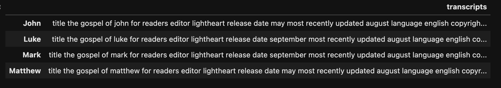

It's not perfect but we don't necessarily need perfection to be able to perform our analysis. 
Next we turn our various forms of data into the .pkl format for later use.

```python
# pickle for later use
data_df.to_pickle("corpus.pkl")
```


```python 
#pickle for later
data_dtm.to_pickle("dtm.pkl")

# pickle cleaned data
data_clean.to_pickle('data_clean.pkl')
pickle.dump(cv, open("cv.pkl", "wb"))
```

## Exploring The Data

Now that we have cleaned the data and stored it in .pkl files let's explore a bit.
For this section we'll need to import 5 libraries: Pandas, Counter from collections, CountVectorizer from sklearn, WordCloud, and matplotlib (pyplot). We'll also still be using pickle to manage our transcripts.

The imports: 
```python
import pandas as pd
from collections import Counter
from sklearn.feature_extraction import text 
from sklearn.feature_extraction.text import CountVectorizer
from wordcloud import WordCloud
import matplotlib.pyplot as plt
```

Our first step is to transpose the data before learning about the word counts.

```python
data = pd.read_pickle('dtm.pkl')
data = data.transpose()
data.head()
```
And here is what that data.head() produces:
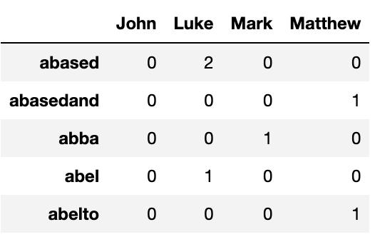

Next let's look at the top 30 words in each gospel. 
For this we loop through the columns and sort the words in descending order (most occurrences to least) and store the top 30 options.
```
# top thirty words
top_dict = {}
for c in data.columns:
    top = data[c].sort_values(ascending=False).head(30)
    top_dict[c]= list(zip(top.index, top.values))

top_dict
```
The output from this code is rather long so I won't show it here but as you would expect, 'Jesus' is at or near the top of the most used words for each Gospel. We will print out the top 15 for each though.

```python
# print the top 15 words in each gospel
for gospel, top_words in top_dict.items():
    print(gospel)
    print(', '.join([word for word, count in top_words[0:14]]))
    print('---')
```
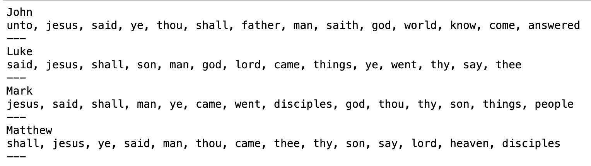

Looks like the old school King James Version words are really showing out here. We could go back and clean these up further but for now let's continue on.
Now we can find the most common words across all of the Gospels.
```python
# to find differences in the gospels, we'll pull out the most common words across the gospels
from collections import Counter
# pull first 30 words
words = []
for gospel in data.columns:
    top = [word for (word, count) in top_dict[gospel]]
    for t in top:
        words.append(t)
        
words
```
Next we'll aggregate the most common words,

```python
#aggregate words
Counter(words).most_common()
```
This is a long output so I won't show it here but words like 'Jesus', 'God', and 'disciples' all occur in each Gospel. 
Other words like 'heaven', 'jews', and 'world' only occur in one Gospel each. I was a bit surprised by 'heaven' only occuring once.

Now we'll exclude words that occur in more than half of the Gospels by adding them to our stop words.
```python
# if more than half the gospels use the word we'll exclude it
add_stop_words = [word for word, count in Counter(words).most_common() if count > 2]
add_stop_words
```
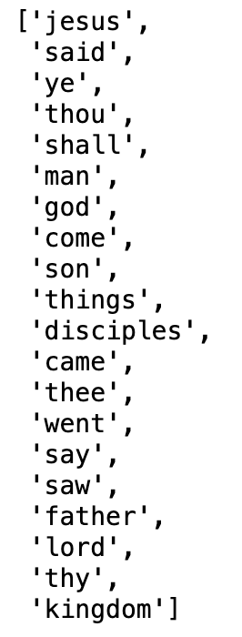

Next we'll use the new stop words to create a new .pkl file

```
# use newly create stop words
from sklearn.feature_extraction import text 
from sklearn.feature_extraction.text import CountVectorizer

# Read in cleaned data
data_clean = pd.read_pickle('data_clean.pkl')

# Add new stop words
stop_words = text.ENGLISH_STOP_WORDS.union(add_stop_words)
# Recreate document-term matrix
cv = CountVectorizer(stop_words=list(stop_words))
data_cv = cv.fit_transform(data_clean.transcripts)
data_stop = pd.DataFrame(data_cv.toarray(), columns=cv.get_feature_names_out())
data_stop.index = data_clean.index

# Pickle it for later use
import pickle
pickle.dump(cv, open("cv_stop.pkl", "wb"))
data_stop.to_pickle("dtm_stop.pkl")
```

With the words aggregated we can now make some word clouds!

```python
# make word clouds
from wordcloud import WordCloud

wc = WordCloud(stopwords=stop_words, background_color="white", colormap="Dark2",
               max_font_size=150, random_state=42)
```
We'll use matplotlib pyplot to show the wordclouds.
```python
# plots
import matplotlib.pyplot as plt

plt.rcParams['figure.figsize'] = [16, 6]

gospel_names = ['Matthew', 'Mark', 'Luke', 'John']

for index, gospel in enumerate(data.columns):
    wc.generate(data_clean.transcripts[gospel])
    
    plt.subplot(3, 4, index+1)
    plt.imshow(wc, interpolation="bilinear")
    plt.axis("off")
    plt.title(gospel_names[index])
    
plt.show()
```
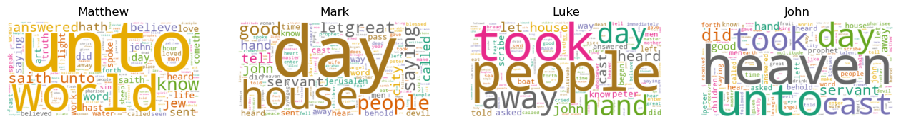

 It could be the word 'unto' is indicative of a translators word preference rather than something the original writers intended to use. World, House, People, and Heaven seem like the real top topics. An obvious improvement we could mak here is to add 'unto' and possibly a few other words to our stop list. Maybe that will be a future iteration. For now let's move on and take a look at the unique words for each Gospel.

 ```python
 # number of unique words in each gospel
# Identify the non-zero items in the document-term matrix, meaning that the word occurs at least once
unique_list = []
for gospel in data.columns:
    uniques = data[gospel].to_numpy().nonzero()[0].size
    unique_list.append(uniques)

# Create a new dataframe that contains this unique word count
data_words = pd.DataFrame(list(zip(gospel_names, unique_list)), columns=['gospel', 'unique_words'])
data_unique_sort = data_words.sort_values(by='unique_words')
data_unique_sort
```
Even though it would probably be easy to search online for total word counts in the gospel, we'll count them anyway.
```python
total_list = []
for gospel in data.columns:
    totals = sum(data[gospel])
    total_list.append(totals)

data_total_words = pd.DataFrame(list(zip(gospel_names, total_list)), columns=['gospel', 'total_words'])
data_total_sort = data_total_words.sort_values(by='total_words')
data_total_sort
```
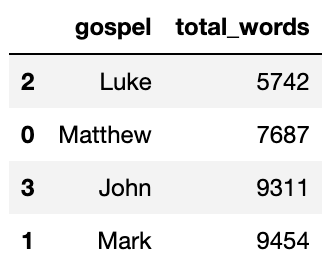

That table is easy to read but just for a bit more clarity lets make a bar chart with those numbers.

```python
bar_colors = ['red', 'green', 'blue', 'purple']
fig, ax = plt.subplots()

ax.bar(gospel_names, total_list, color=bar_colors)
ax.set_ylabel('Word Count')
ax.set_title('Gospel Word Counts')
plt.show()
```
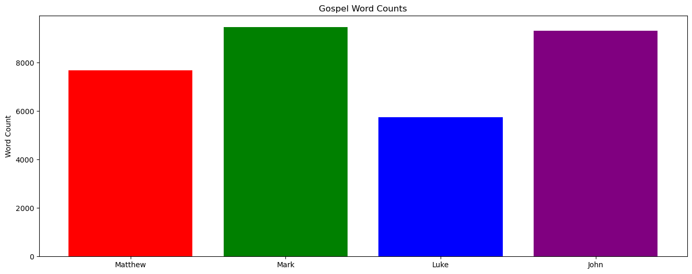

Let's also put the unique word counts in a bar chart format.

```python
fig, ax = plt.subplots()

ax.bar(gospel_names, unique_list, color=bar_colors)
ax.set_ylabel('Unique Word Count')
ax.set_title('Gospel Unique Word Counts')
plt.show()
```
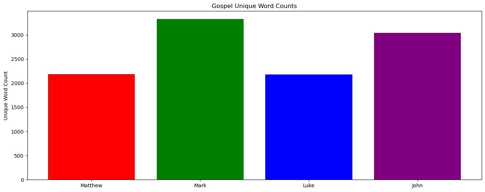

Those two charts look pretty similar. In the total count chart, the visual difference between Mark and John is hard to tell. Similarly, in the unique word counts chart, Matthew and Luke are very hard to tell which one is greater.

Let's try calculating a ratio of total words to unique words.

```python
ratios = [totals / uniques for totals, uniques in zip(total_list, unique_list)]
ratios
```
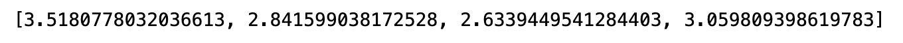

And let's plot the ratios.

```python
fig, ax = plt.subplots()
ax.bar(gospel_names, ratios, color=bar_colors)
ax.set_ylabel('Unique to Total word ratios')
ax.set_title('Gospel Unique Word to Total Word Counts')
plt.show()
```
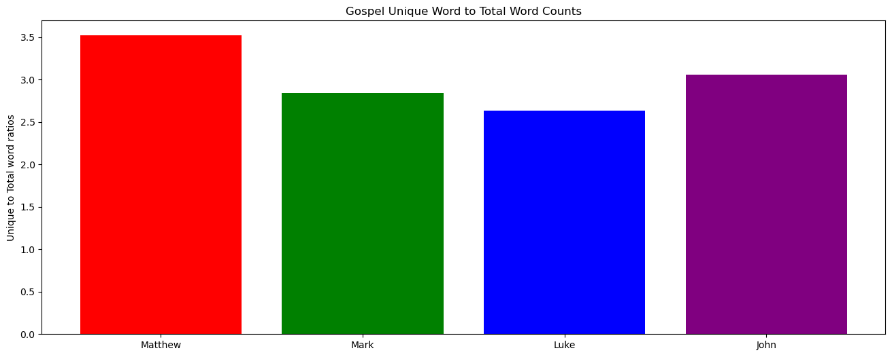

But wait, was that the right way to measure that? The chart above makes the book that has the least amount of unique words look like the best. I'm not intending to say one gospel is better than the other but let's see which Gospel has the best ratio of unique words to total words.

```python
# lets reverse it
good_ratios = [uniques / totals for uniques,totals  in zip(unique_list, total_list)]
good_ratios
```
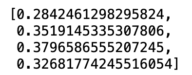
PLOT PLOT PLOT!
```
fig, ax = plt.subplots()
ax.bar(gospel_names, good_ratios, color=bar_colors)
ax.set_ylabel('Unique to Total word ratios')
ax.set_title('Gospel Unique Word to Total Word Counts')
plt.show()
```
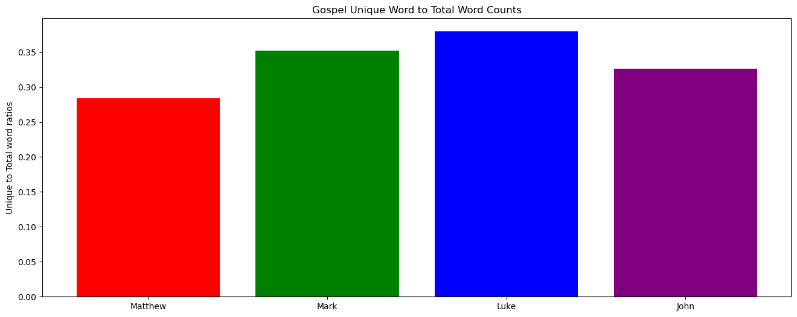

Luke was reportedly a physician so it might be expected that he would have a better ratio of unique words to total words. Of course, we may also be running into the influence of the translator.

## Sentiment Analysis

We've cleaned our transcript data and learned more about the Gospels by doing some data exploration. Now it's time to perform some sentiment analysis! For this section we'll be using the pandas, TextBlob, matplotlib pyplot, numpy, and math libraries.

```python
import pandas as pd
from textblob import TextBlob
import matplotlib.pyplot as plt
import numpy as np
import math
```
We'll start off by reading in our transcripts from a previously created pickle file.
```python
data = pd.read_pickle('corpus.pkl') # side note -- isn't it funny that pickle is a file type?
data
```
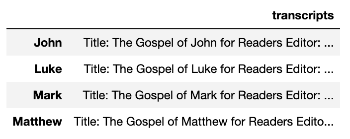
Nothing new here but it gives us a good starting point. Next let's use TextBlob to gather some polarity and subjectivity information about the gospels.

```python
#lambda functions to find polarity and subjectivity
from textblob import TextBlob

pol = lambda x: TextBlob(x).sentiment.polarity
sub = lambda x: TextBlob(x).sentiment.subjectivity

data['polarity'] = data['transcripts'].apply(pol)
data['subjectivity'] = data['transcripts'].apply(sub)
data
```

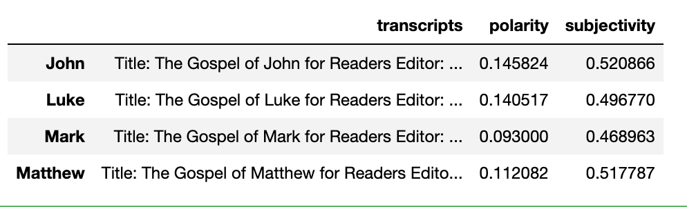

Now we can plot this data. If you aren't familiar with subjectivity and polarity in this format, subjectivity ranges from 0, which represents objective facts, to 1, which represents subjective opinions. Polarity ranges from -1, which represents negative language, to 1, which represents positive language.
```python
# plot it
import matplotlib.pyplot as plt

plt.rcParams['figure.figsize'] = [10, 8]


for index, gospel in enumerate(data.index):
#     print('hey', data['transcripts'][str(gospel)])
    x = data['polarity'].loc[gospel]
  
    y = data['subjectivity'].loc[gospel]
#     print('x', x, 'y', y, data)
    plt.scatter(x, y, color='blue')
   
    plt.text(x+.001, y+.001, data['transcripts'][str(gospel)][index], fontsize=10)
    plt.xlim(-.01, .15) 
    
plt.title('Sentiment Analysis', fontsize=20)
plt.xlabel('<-- Negative -------- Positive -->', fontsize=15)
plt.ylabel('<-- Facts -------- Opinions -->', fontsize=15)

plt.show()
```
We can see that the Gospel of John is in the top right of our chart. It seems to be more opinionated but also the most positive of the Gospels. The Gospel of Mark, on the other hand, is much less positive and also rated as more factual.
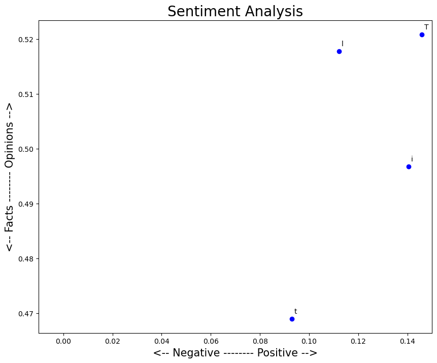

It might be more interesting to see the sentiment of the gospels as they progress. To accomplish this, we'll split them into 10 sections. First we will set up a function to perform the splitting.

```python
def split_text(text, n=10):
    '''Takes in a string of text and splits into n equal parts, with a default of 10 equal parts.'''
    
    # Calculate length of text, the size of each chunk of text and the starting points of each chunk of text
    length = len(text)
    size = math.floor(length / n)
    start = np.arange(0, length, size)
    
    # Pull out equally sized pieces of text and put it into a list
    split_list = []
    for piece in range(n):
        split_list.append(text[start[piece]:start[piece]+size])
    return split_list
```
Now let's  use that method store each piece.
```python
# Let's create a list to hold all of the pieces of text
list_pieces = []
for t in data.transcripts:
    split = split_text(t)
    list_pieces.append(split)
    
```
We can double check our code by using the length function.

```python
len(list_pieces[0]) # each gospel split into 10 sections
```
This returns 10 so we're good to go. 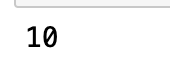

Next let's calculate the polarity of each section.

```python
# calculate each section of each gospel
polarity_transcript = []
for lp in list_pieces:
    polarity_piece = []
    for p in lp:
        polarity_piece.append(TextBlob(p).sentiment.polarity)
    polarity_transcript.append(polarity_piece)
    
polarity_transcript
```
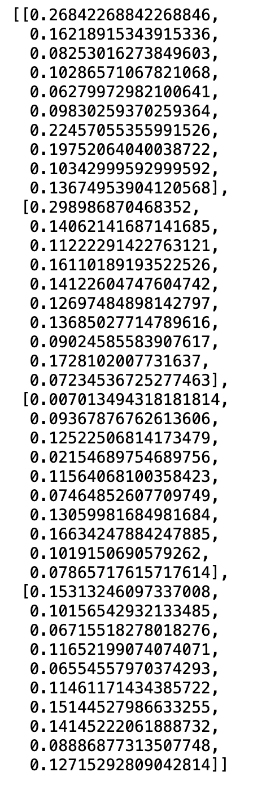

As stated earlier, negative numbers would represent negative language but it looks like none of the sections dip into the negative. At the same time none of the values are too high above 0 or anywhere near 1 so over all the transcripts are just on the positive side of neutral.

Let's take a look at the Gospel of John to see a representation of how the Gospel progresses from a polarity perspective.

```python
# plot for one gospel
plt.plot(polarity_transcript[0])
plt.title(data['transcripts'].index[0])
plt.show()
```
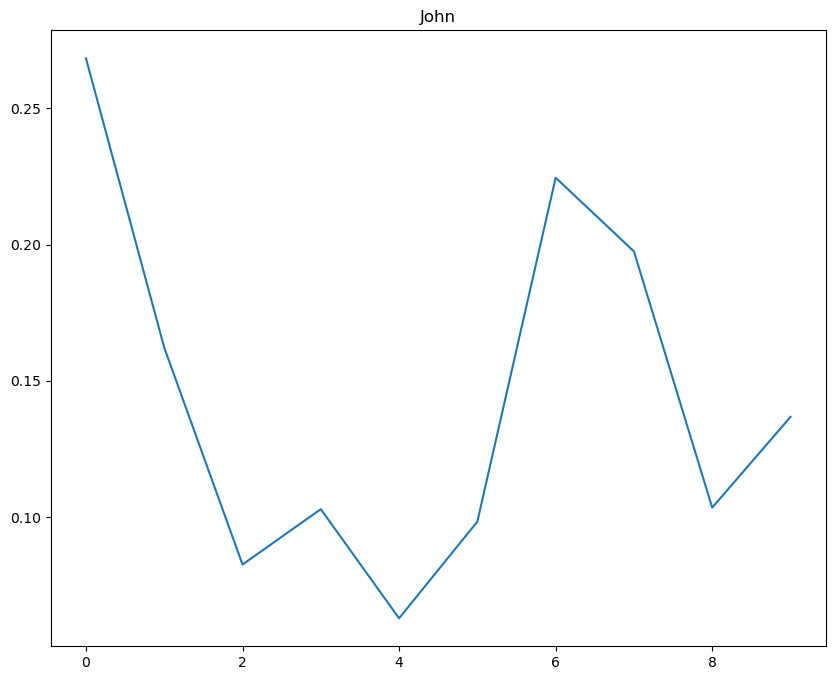

It might be fun to pin point certain events in the Gospel on this chart that correlate with the differen high and low points. That will be a project for another day though.

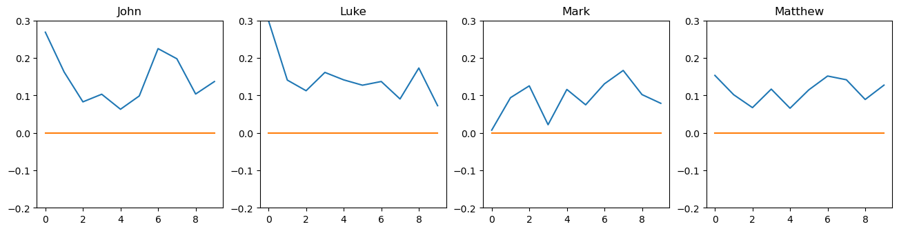
Mark seems to start off in an almost dark place. Perhaps some of the language around John the Baptist being put in prison and Jesus casting out an evil spirit are pushing the polarity down. John, Luke, and Matthew do seem to have some visual similarities. They start positive and drop down with a bownce back upward towards the end.

## Topic Modeling

Next up, we'll figure out what topics are covered in each Gospel. For this section we'll be using pandas, pickle, matutils and models from gensim, scipy.parse, word_tokenize and pos_tag from ntlk, and text and CountVectorizer from sklearn.feature_extraction. The modules from gensim will allow us to perform latent Dirichlet allocation or LDA. This blog post isn't focused on teaching data science so I won't get too much into the weeds on LDA. Frankly, I'm probably not qualified to give a great explanation on it. However, [LDA is a Bayesian network for modeling topics](https://en.wikipedia.org/wiki/Latent_Dirichlet_allocation).

```python
import pandas as pd
import pickle
from gensim import matutils, models
import scipy.sparse
from nltk import word_tokenize, pos_tag
from sklearn.feature_extraction import text
from sklearn.feature_extraction.text import CountVectorizer
```
As usual, we will start by reading our data from a previously generated pickle file.
```python
data = pd.read_pickle('dtm_stop.pkl')
data
```
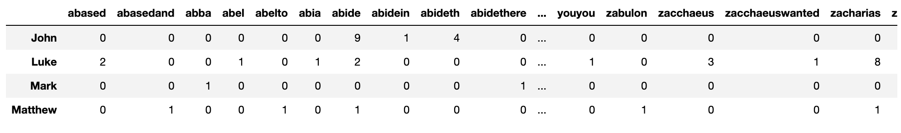

Yep, it's still there! Now we'll transpose to a term-doocument matrix.
```python
# One of the required inputs is a term-document matrix
tdm = data.transpose()
tdm.head()
```
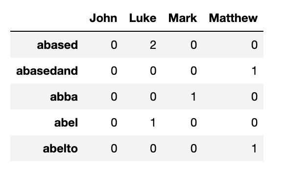

Now we will convert to a gensim format and create a dictionary for gensim.
```python
# We're going to put the term-document matrix into a new gensim format, from df --> sparse matrix --> gensim corpus
sparse_counts = scipy.sparse.csr_matrix(tdm)
corpus = matutils.Sparse2Corpus(sparse_counts)

# Gensim also requires dictionary of the all terms and their respective location in the term-document matrix
cv = pickle.load(open("cv_stop.pkl", "rb"))
id2word = dict((v, k) for k, v in cv.vocabulary_.items())
```

Now we have a corpus to work with in the term-document matrix we can start trying out different parameters with LDA models.

```python
# we need to specify two other parameters as well - the number of topics and the number of passes
lda = models.LdaModel(corpus=corpus, id2word=id2word, num_topics=2, passes=10)
lda.print_topics()
```
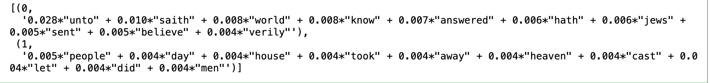
LDA with 3 topics now.
```python
# LDA for num_topics = 3
lda = models.LdaModel(corpus=corpus, id2word=id2word, num_topics=3, passes=10)
lda.print_topics()
```
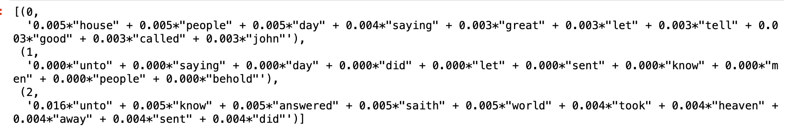

4 topics
```python
# LDA for num_topics = 4
lda = models.LdaModel(corpus=corpus, id2word=id2word, num_topics=4, passes=10)
lda.print_topics()
```
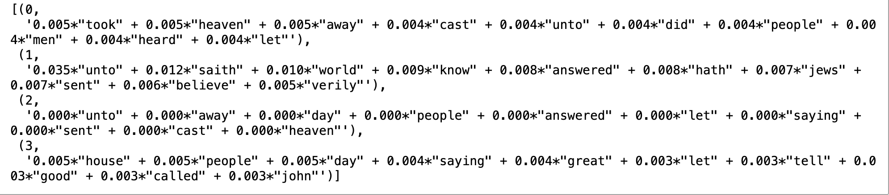

Some of these 'topics' aren't really topics. We're once again seeing 'unto'. Let's remove it and some other words that aren't relevant.

```python
# Let's create a function to pull out nouns from a string of text
from nltk import word_tokenize, pos_tag

def nouns(text):
    '''Given a string of text, tokenize the text and pull out only the nouns.'''
    is_noun = lambda pos: pos[:2] == 'NN'
    tokenized = word_tokenize(text)
    all_nouns = [word for (word, pos) in pos_tag(tokenized) if is_noun(pos)] 
    return ' '.join(all_nouns)
```
Then we'll read in our cleaned data.
```python
# Read in the cleaned data, before the CountVectorizer step
data_clean = pd.read_pickle('data_clean.pkl')
```
Now we can use the nouns function on our cleaned data
```python
# Apply the nouns function to the transcripts to filter only on nouns
data_nouns = pd.DataFrame(data_clean.transcripts.apply(nouns))
data_nouns
```
This results in a nouns only version of the transcripts.
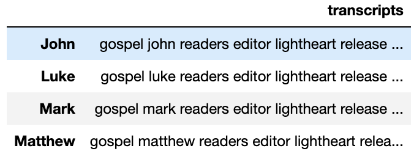

Next we're going to recreate a document-term matrix with the noun only transcripts and also clean out some other words we don't want to treat as topics.

```python
# Re-add the additional stop words since we are recreating the document-term matrix
add_stop_words = ['andif','himand','like', 'im', 'know', 'just', 'dont', 'thats', 'right', 'people',
                  'youre', 'got', 'gonna', 'time', 'think', 'yeah', 'said', 'unto', 'saith', 'hath', 'thou', 'ye', 'thee', 'hast', 'shalt',
                 'sayest', 'cometh', 'woe']
stop_words = text.ENGLISH_STOP_WORDS.union(add_stop_words)

# Recreate a document-term matrix with only nouns
cvn = CountVectorizer(stop_words=list(stop_words))
data_cvn = cvn.fit_transform(data_nouns.transcripts)
data_dtmn = pd.DataFrame(data_cvn.toarray(), columns=cvn.get_feature_names_out())
data_dtmn.index = data_nouns.index
data_dtmn
```

Then we will create another gensim corpus and vocab dictionary.
```python
# Create the gensim corpus
corpusn = matutils.Sparse2Corpus(scipy.sparse.csr_matrix(data_dtmn.transpose()))

# Create the vocabulary dictionary
id2wordn = dict((v, k) for k, v in cvn.vocabulary_.items())
```
We'll also repeat the process of trying the LDA model with different topics parameters.
```python
# Let's start with 2 topics
ldan = models.LdaModel(corpus=corpusn, num_topics=2, id2word=id2wordn, passes=10)
ldan.print_topics()
```
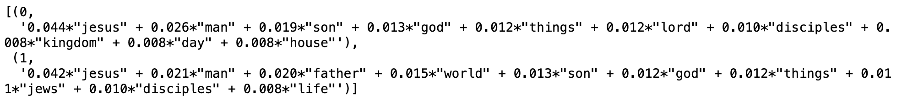

Definitely looks better than before we filtered for nouns and got rid of stop words and other non relevant words.

```python

# Let's try topics = 3
ldan = models.LdaModel(corpus=corpusn, num_topics=3, id2word=id2wordn, passes=10)
ldan.print_topics()
```
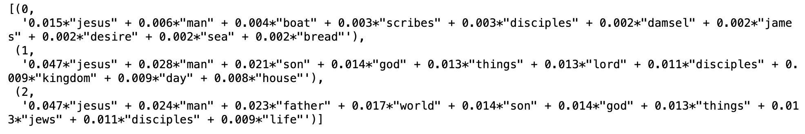

And once again 4 topics.
```python
# Let's try 4 topics
ldan = models.LdaModel(corpus=corpusn, num_topics=4, id2word=id2wordn, passes=10)
ldan.print_topics()
```
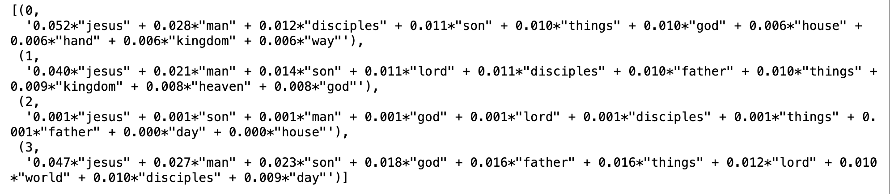

Similar to pulling the nouns out, let's now pull nouns and adjectives out. 
```python
def nouns_adj(text):
    '''Given a string of text, tokenize the text and pull out only the nouns and adjectives.'''
    is_noun_adj = lambda pos: pos[:2] == 'NN' or pos[:2] == 'JJ'
    tokenized = word_tokenize(text)
    nouns_adj = [word for (word, pos) in pos_tag(tokenized) if is_noun_adj(pos)] 
    return ' '.join(nouns_adj)
```
Then create a dataframe with the nouns and adjectives.
```python
data_nouns_adj = pd.DataFrame(data_clean.transcripts.apply(nouns_adj))
data_nouns_adj
```
Here's what that looks like.
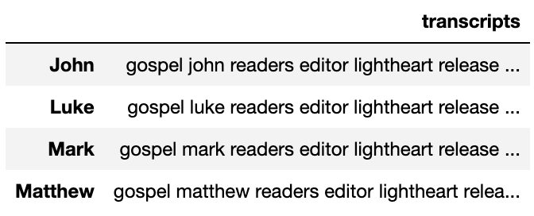

Now we will create another document-term matrix with the nouns and adjectives while also removing common words.
```python
cvna = CountVectorizer(stop_words=list(stop_words), max_df=.8)
data_cvna = cvna.fit_transform(data_nouns_adj.transcripts)
data_dtmna = pd.DataFrame(data_cvna.toarray(), columns=cvna.get_feature_names_out())
data_dtmna.index = data_nouns_adj.index
data_dtmna
```
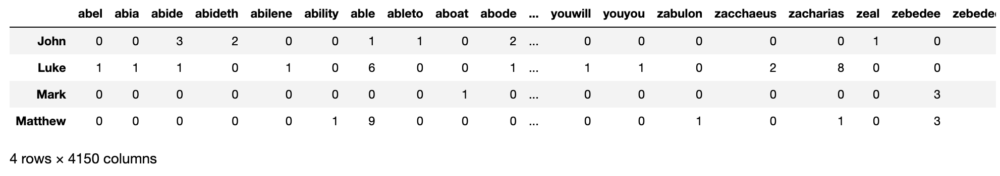

Now we will create the gensim corpus and vocab dictionary.
```python
# Create the gensim corpus
corpusna = matutils.Sparse2Corpus(scipy.sparse.csr_matrix(data_dtmna.transpose()))

# Create the vocabulary dictionary
id2wordna = dict((v, k) for k, v in cvna.vocabulary_.items())
```
Now once again we'll run through various topic quantities.

```python
# Let's start with 2 topics
ldana = models.LdaModel(corpus=corpusna, num_topics=2, id2word=id2wordna, passes=10)
ldana.print_topics()
```
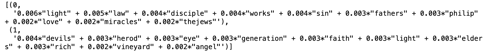

What do you say to 3 topics again?
```python
# Let's try 3 topics
ldana = models.LdaModel(corpus=corpusna, num_topics=3, id2word=id2wordna, passes=10)
ldana.print_topics()
```

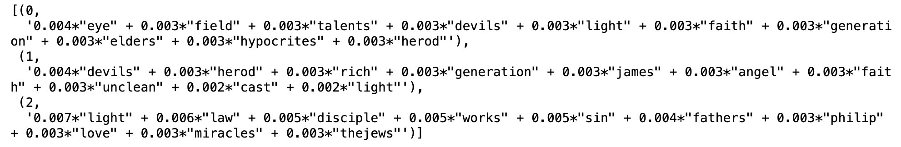

At this point you knew we were going to 4 so here it is.

```python
# Let's try 4 topics
ldana = models.LdaModel(corpus=corpusna, num_topics=4, id2word=id2wordna, passes=10)
ldana.print_topics()
```

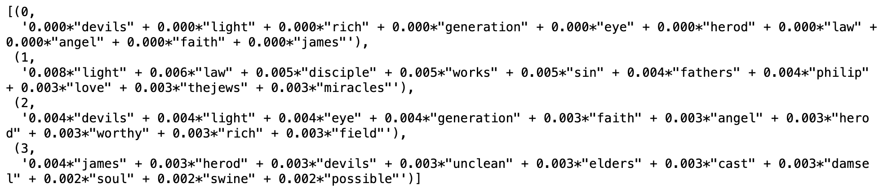

Ok 4 is good so now let's increase the passes
```python
# Our final LDA model (for now)
ldana = models.LdaModel(corpus=corpusna, num_topics=4, id2word=id2wordna, passes=80)
ldana.print_topics()
```
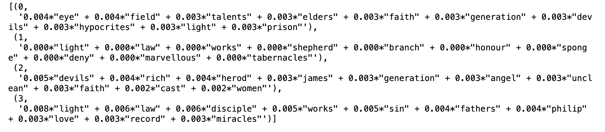

Looks like it's a lot of the same words but the ordering has changed a bit with some new words mixing in. I also originally found some weird combo words showing up like 'andif' and 'himand'. I added those to the stop words and recreated the above results with those words removed.

Now we can check which of the Gospels best match these topics.
```python
# Let's take a look at which topics each transcript contains
corpus_transformed = ldana[corpusna]
list(zip([a for [(a,b)] in corpus_transformed], data_dtmna.index))
```
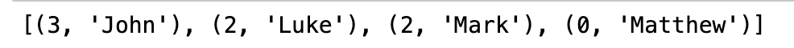

Interestingly, none of the Gospels line up with the second topic set (number 1). Both Luke and Mark contain topic 2. This is despite their differences in polarity and subjectivity.

## Text Generation

Now we're reaching the fun part of our research. We've cleaned our transcripts, explored the transcripts differences, analyzed the transcripts sentiment, and modeled their topics. Now it is time to use them to generate text. It's going to get a bit silly. We'll use pandas, defaultdict from collections, and random to create markov chains.

```python
import pandas as pd
from collections import defaultdict
import random
```
Once again let's read in our corpus.
```python
data = pd.read_pickle('corpus.pkl')
data
```
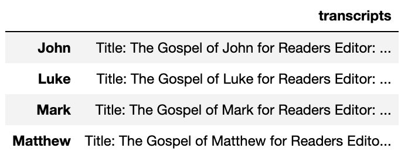
Let's start with the Gospel of John.
```python
john_text = data.transcripts.loc['John']
john_text[:200]
```
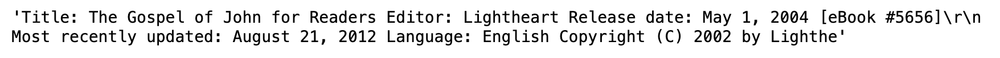

Now let's setup the markov chain function.

```python
def markov_chain(text):
    '''The input is a string of text and the output will be a dictionary with each word as
       a key and each value as the list of words that come after the key in the text.'''
    
    # Tokenize the text by word, though including punctuation
    words = text.split(' ')
    
    # Initialize a default dictionary to hold all of the words and next words
    m_dict = defaultdict(list)
    
    # Create a zipped list of all of the word pairs and put them in word: list of next words format
    for current_word, next_word in zip(words[0:-1], words[1:]):
        m_dict[current_word].append(next_word)

    # Convert the default dict back into a dictionary
    m_dict = dict(m_dict)
    return m_dict

```
Next we will create a dictionary for the Gospel of John.
```python
john_dict = markov_chain(john_text)
john_dict
```
This dictionary is rather long so we won't show it here.
Next we will write a function to generate a sentence using the Gospel of John.
```python
def generate_sentence(chain, count=15):
    '''Input a dictionary in the format of key = current word, value = list of next words
       along with the number of words you would like to see in your generated sentence.'''

    # Capitalize the first word
    word1 = random.choice(list(chain.keys()))
    sentence = word1.capitalize()

    # Generate the second word from the value list. Set the new word as the first word. Repeat.
    for i in range(count-1):
        word2 = random.choice(chain[word1])
        word1 = word2
        sentence += ' ' + word2

    # End it with a period
    sentence += '.'
    return(sentence)

    generate_sentence(john_dict)
```
Remember when I said things were going to get silly. Here we go.
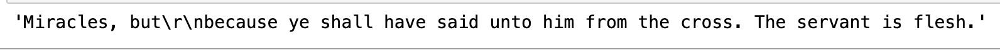

'The servant is flesh'. Now those are some words to live by.
Now let's do the same thing for the other three gospels. We still won't display the dictionaries due to their length.
```python
matthew_text = data.transcripts.loc['Matthew']
# Create the dictionary for Matthew's gospel, take a look at it
matthew_dict = markov_chain(matthew_text)
matthew_dict

generate_sentence(matthew_dict)
```


Seems like these typically start off ok but then get weird at the end. Let's check the other two Gospels.

```python
mark_text = data.transcripts.loc['Mark']
# Create the dictionary for Matthew's gospel, take a look at it
mark_dict = markov_chain(mark_text)
mark_dict

generate_sentence(mark_dict)
```
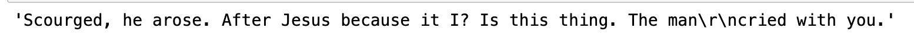

This time the beginning and end make sense but the middle is whacky.

```python
# ok that one starts off ok but then goes off the rails
luke_text = data.transcripts.loc['Luke']
# Create the dictionary for Luke's gospel, take a look at it
luke_dict = markov_chain(luke_text)
luke_dict

generate_sentence(luke_dict)
```
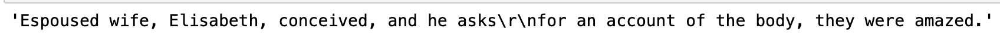

Change the pronoun from he to she and this one isn't that crazy. Overall pretty fun though. Also we have to take into account that our sentences are generated based on the King James Version which is definitely out of date.
That's the end of the research for now. Perhaps in the future we'll take on some other books in the bible. I think something more apocalyptic, such as Revelations and Ezekiel, would be fun. I may also think about splitting this post into 4 sections to make it a bit easier to consume.

